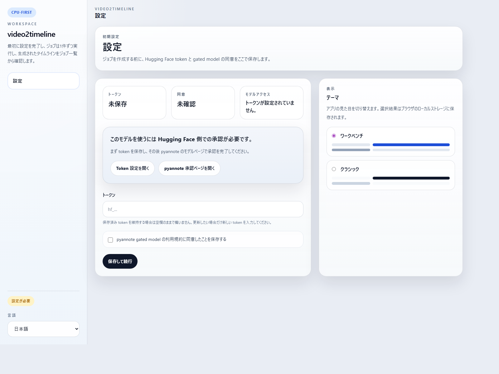
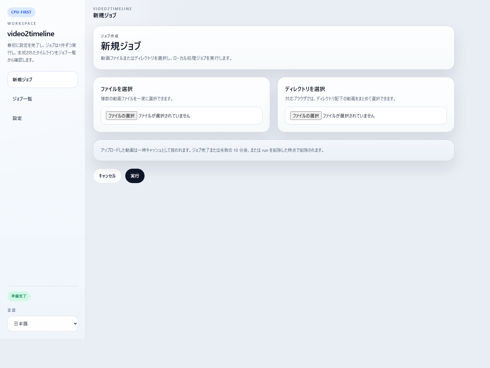
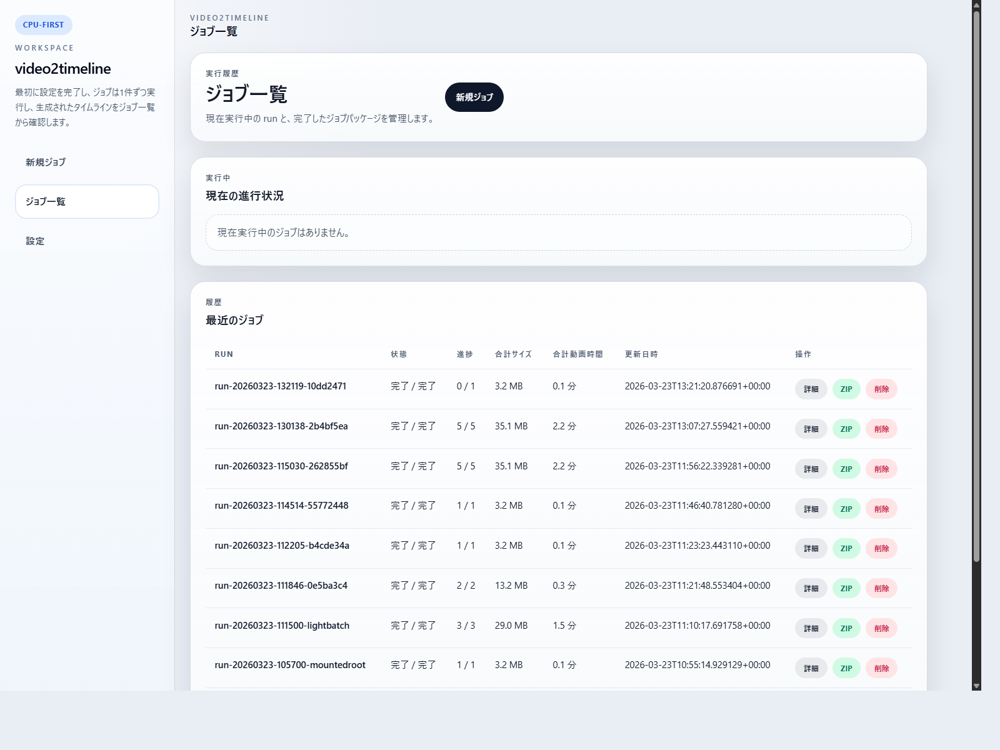
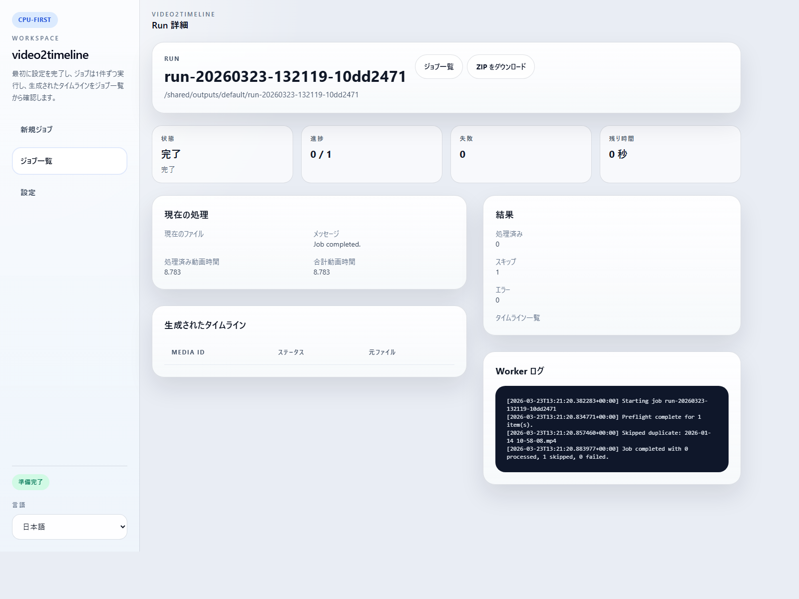

# TimelineForVideo

手元にある動画ファイルを、ChatGPT などの LLM に渡しやすいタイムライン資料へ変換するローカルツールです。

[English README](README.md) | [サンプルタイムライン](docs/examples/sample-timeline.ja.md) | [第三者ライセンス](THIRD_PARTY_NOTICES.md) | [モデルと実行環境メモ](MODEL_AND_RUNTIME_NOTES.md) | [セキュリティと安全性](docs/SECURITY_AND_SAFETY.md) | [公開前チェック](docs/PUBLIC_RELEASE_CHECKLIST.md) | [ライセンス](LICENSE)

## Public Release Status

現在の public release 系列は `TimelineForVideo v0.3.3 Tech Preview` です。

現時点の public contract:

- baseline support: Windows + Docker Desktop + CPU mode
- macOS: source-based experimental path
- GPU mode: optional, NVIDIA-only, best-effort
- 話者分離は optional で、`pyannote/speaker-diarization-community-1` の gated approval と Hugging Face token が必要
- これは local-first の desktop-style tool であり、hosted SaaS ではありません

## このアプリがやっていること

このアプリは、手元にある動画ファイルを、LLM に渡しやすい ZIP 資料に変換するためのものです。

内部では、主に次のことを行います。

1. 動画の音声を読み取って文字にします
2. 画面に映っている文字や内容を拾います
3. 会話と画面の変化を時系列のタイムラインとして整理します
4. 最終結果を ZIP にまとめます

使う側がモデル名や細かい内部処理を理解する必要はありません。

## どんな用途に向いているか

- 会議の振り返り
- 会話ログの分析
- 家族や友人との会話の整理
- 画面録画の振り返り
- 古い動画資産のテキスト化

## スクリーンショット

### 言語選択


### 設定



### 新規ジョブ



### ジョブ一覧



### ジョブ詳細



## 基本的な流れ

1. 動画ファイルを選ぶ  
   複数ファイルも選べます
2. 実行する
3. 完了まで待つ  
   高度な AI 処理を行うため、ある程度時間がかかります
4. ZIP をダウンロードする
5. 必要なら、その ZIP を ChatGPT や Claude などの LLM に渡して活用する

たとえば、次のような使い方ができます。

- 会議内容を要約する
- 決定事項や宿題を抜き出す
- 自分の説明の癖を振り返る
- 会話パターンを分析する
- 動画の蓄積を検索しやすいメモにする

## ZIP に入るもの

ダウンロードされる ZIP は、できるだけコンパクトにしています。

主に入るのは次の 3 つです。

- `README.md`
- `TRANSCRIPTION_INFO.md`
- `timelines/<撮影日時>.md`
- 一部失敗や warning がある場合は `FAILURE_REPORT.md`
- 一部失敗や warning がある場合は `logs/worker.log`

例:

```text
TimelineForVideo-export.zip
  README.md
  TRANSCRIPTION_INFO.md
  timelines/
    2026-03-26 18-00-00.md
    2026-03-25 09-14-12.md
```

`timelines/` の中の Markdown が、動画ごとの最終成果物です。

ジョブが一部失敗でも一部成功していれば、ZIP はそのままダウンロードできます。その場合は成功した timeline に加えて、失敗内容の要約と worker log も同梱されます。

## 再利用と再実行

以前に処理したことがあるファイルをアップロードすると、アプリは再利用できる既存結果があるかを先に確認します。

- 再利用可能な timeline が残っている場合は、既存結果を再利用するか再処理するかを選べます
- 再利用した結果も、新しいジョブの詳細画面からそのまま確認できます
- ジョブ詳細からは、同じ元ファイルを次の 2 通りで再実行できます
  - 元ジョブと同じ設定で再実行
  - `Settings` の現在設定で再実行

これにより、計算モードや処理精度、話者分離まわりの設定を変えたあとでも再実行しやすくしています。

## 内部作業フォルダと ZIP の違い

Docker 内では、処理のためにもう少し大きな作業フォルダを持っています。

そこには、たとえば次のようなものが入ります。

- request / status の JSON
- worker ログ
- 中間の文字起こしファイル
- 画面差分メモ
- 一時ファイル

これらはアプリ内部で使うものです。普段ユーザーが見るのは、ダウンロードした ZIP の中身だけで十分です。

## クイックスタート

Windows:

```powershell
.\start.bat
```

`v0.3.3` の public release では、これが primary supported path です。

macOS:

```bash
./start.command
```

こちらは `v0.3.3` では experimental な source-based path です。現在の public release line の baseline support には含めません。

起動後の流れ:

1. 言語を選ぶ
2. `Settings` を開く
3. 話者分離を使いたい場合は Hugging Face token を保存する
4. `CPU` か `GPU` を選ぶ
5. 処理精度を選ぶ
6. 新しいジョブを作る
7. 処理完了まで待つ
8. ZIP をダウンロードする

処理中は、ジョブ一覧とジョブ詳細の両方で経過時間と残り時間の目安を表示します。この残り時間は、完了したジョブが増えるほど補正に使える履歴が増えていきます。

起動スクリプトは、Google Chrome / Microsoft Edge / Brave / Chromium のいずれかで専用ウィンドウ風に開こうとします。使えない場合は通常のブラウザで開きます。

## 必要なもの

- primary supported path としての Windows
- experimental な source-based path としての macOS
- Docker Desktop
- 初回のコンテナ・モデル取得用のインターネット接続
- `pyannote` 話者分離を使う場合のみ Hugging Face token
- `pyannote` 話者分離を使う場合のみ gated approval
- GPU モードを使う場合は NVIDIA GPU と Docker GPU 対応

## 計算モード

public release の baseline は CPU mode です。

- `CPU`
  - 幅広い環境で使える
  - 速度は遅め
- `GPU`
  - Docker から使える NVIDIA GPU が必要
  - 主な AI 処理が高速になる
  - `v0.3.3` では best-effort 扱い

処理精度:

- `Standard`
  - `WhisperX medium`
- `High`
  - `WhisperX large-v3`
  - GPU モードかつ十分な VRAM がある場合のみ使用可能

この開発環境では `NVIDIA GeForce RTX 4070` で GPU 実行を確認しています。

## 対応する入力形式

主な対応形式:

- `.mp4`
- `.mov`
- `.m4v`
- `.avi`
- `.mkv`
- `.webm`

実際に読み込めるかどうかは、ランタイムイメージ内の `ffmpeg` に依存します。

## 言語対応

対応言語:

- `en`
- `ja`
- `zh-CN`
- `zh-TW`
- `ko`
- `es`
- `fr`
- `de`
- `pt`

初回起動時の既定は英語です。選択した言語は `.env` ではなくアプリ設定データに保存されます。

## CLI

通常利用の入口は GUI です。必要なら worker CLI も使えます。

初回 public release では GUI を primary path とします。CLI は advanced path であり、daemon と CLI を同時に回す運用は public support guarantee に含めません。

主なコマンド:

- `settings status`
- `settings save`
- `jobs create`
- `jobs list`
- `jobs show`
- `jobs run`
- `jobs archive`

例:

```powershell
$env:PYTHONPATH=".\worker\src"
python -m timelineforvideo_worker settings status
python -m timelineforvideo_worker settings save --token hf_xxx --terms-confirmed
python -m timelineforvideo_worker jobs create --file C:\path\to\clip.mp4
python -m timelineforvideo_worker jobs create --directory C:\path\to\folder
python -m timelineforvideo_worker jobs list
python -m timelineforvideo_worker jobs archive --job-id run-YYYYMMDD-HHMMSS-xxxx
```

`jobs archive` を使うと、GUI でダウンロードするのと同じような ZIP 形式で出力できます。

## テスト

現在のテストは軽めです。

- Python worker の unit test
- ASP.NET Core UI の Playwright ベース smoke test
- 実データでの手動 smoke test

worker unit test:

```powershell
$env:PYTHONPATH=".\worker\src"
python -m unittest discover .\worker\tests
```

ブラウザ E2E:

```powershell
.\scripts\test-e2e.ps1
```

commit 前に lint を有効にする場合:

```powershell
git config core.hooksPath .githooks
```

## ライセンス

このリポジトリは MIT License です。詳細は [LICENSE](LICENSE) を参照してください。
