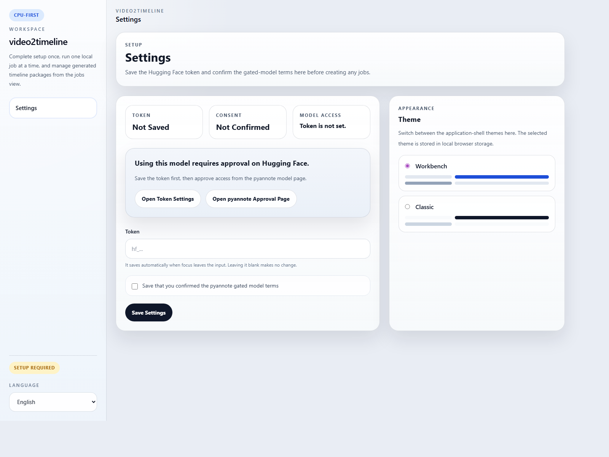
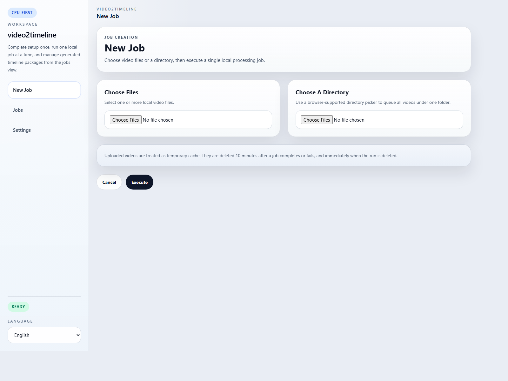
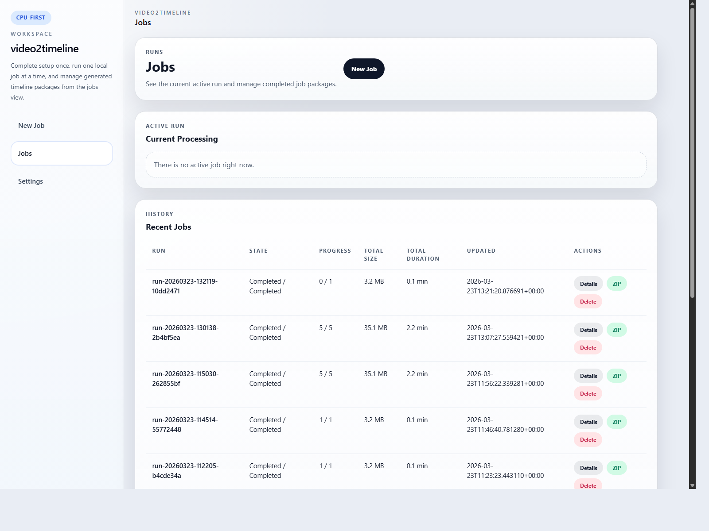
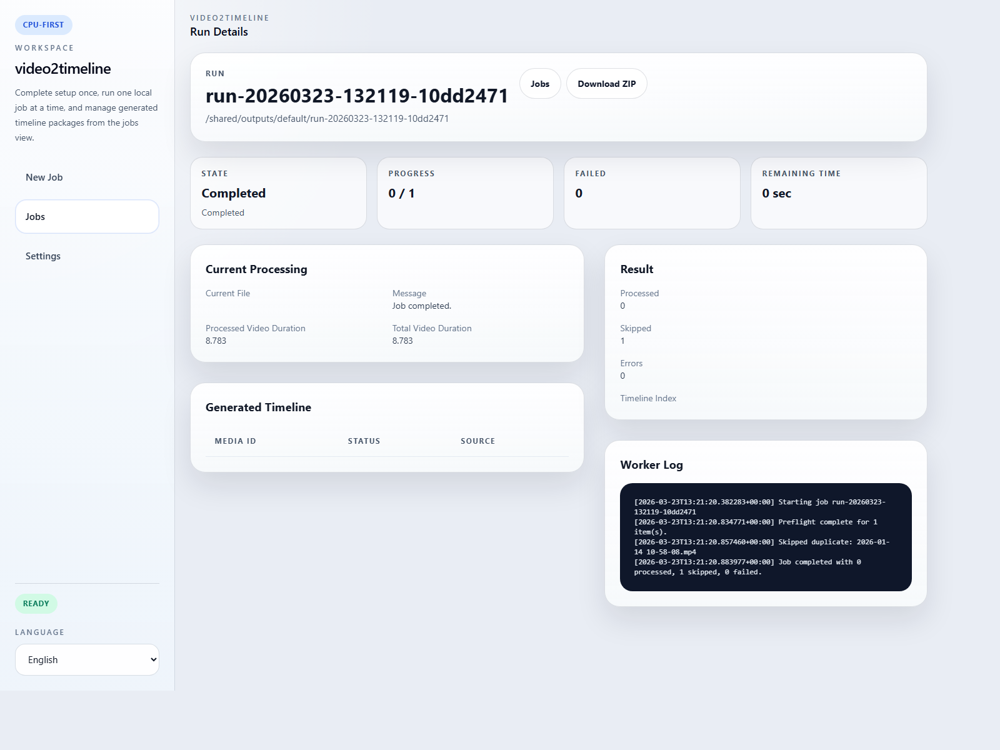

# TimelineForVideo

Turn video files you already have into timeline markdown packages that are easier to hand to ChatGPT or other LLM tools.

[Japanese README](README.ja.md) | [Sample Timeline](docs/examples/sample-timeline.en.md) | [Third-Party Notices](THIRD_PARTY_NOTICES.md) | [Model and Runtime Notes](MODEL_AND_RUNTIME_NOTES.md) | [Security And Safety](docs/SECURITY_AND_SAFETY.md) | [Release Checklist](docs/PUBLIC_RELEASE_CHECKLIST.md) | [License](LICENSE)

## Public Release Status

The current public release line is `TimelineForVideo v0.3.3 Tech Preview`.

Current public contract:

- baseline support: Windows + Docker Desktop + CPU mode
- macOS: source-based experimental path
- GPU mode: optional, NVIDIA-only, best-effort
- speaker diarization: optional, requires a Hugging Face token plus gated approval for `pyannote/speaker-diarization-community-1`
- this is a local-first desktop-style tool, not a hosted SaaS product

## What This App Does

This app takes video files on your computer and turns them into a ZIP package that is easier to upload to an LLM.

Inside the app, the processing is simple:

1. it listens to the speech in the video and turns it into text
2. it checks what was on the screen and extracts useful text or screen notes
3. it puts speech and screen changes into a timeline
4. it puts the final result into a ZIP file

You do not need to know model names or internal details to use it.

## Typical Uses

- meeting review
- conversation history analysis
- family or friend conversation analysis
- screen recording review
- turning old video archives into LLM-ready text material

## Screenshots

### Language


### Settings



### New Job



### Jobs



### Job Details



## Basic Flow

1. choose your video files
2. start processing
3. wait for completion  
   Advanced AI processing takes some time
4. download the ZIP package
5. upload that ZIP to ChatGPT, Claude, or another LLM if you want analysis

Examples of what you can ask an LLM after that:

- summarize the meeting
- extract decisions and action items
- review how I explained things
- analyze conversation patterns
- turn video history into searchable notes

## What Is Inside The ZIP

The ZIP is intentionally compact.

Most users only need:

- `README.md`
- `TRANSCRIPTION_INFO.md`
- `timelines/<captured-datetime>.md`
- `FAILURE_REPORT.md` when some items fail or warnings need to be preserved
- `logs/worker.log` when the job includes failure or warning artifacts

Example:

```text
TimelineForVideo-export.zip
  README.md
  TRANSCRIPTION_INFO.md
  timelines/
    2026-03-26 18-00-00.md
    2026-03-25 09-14-12.md
```

Each markdown file inside `timelines/` is one video timeline.

If a job finishes with partial success, the ZIP still downloads. In that case it contains successful timelines plus the failure report and worker log.

## Reuse And Rerun Behavior

When you upload files that were already processed before, the app checks for reusable results first.

- if reusable timelines are still available, the app asks whether to reuse them or reprocess the files
- reused results remain visible from the new job details screen
- from job details, you can rerun the same source files with either:
  - the same settings as the original job
  - the current settings in `Settings`

This makes it easier to rerun a job after changing compute mode, quality, or diarization-related setup.

## Internal Working Files vs ZIP Output

Inside Docker, the app keeps a larger working folder for processing, logs, and intermediate files.

That internal folder can contain:

- request and status JSON files
- worker logs
- intermediate transcript files
- screenshot notes
- temporary processing files

Those files are for the app itself. The downloadable ZIP is the reduced handoff package for LLM use.

## Quick Start

Windows:

```powershell
.\start.bat
```

This is the primary supported path for the `v0.3.3` public release line.

macOS:

```bash
./start.command
```

This path is available as an experimental source-based setup in `v0.3.3`. It is not the baseline support contract for the current public release line.

Then:

1. choose your language
2. open `Settings`
3. save your Hugging Face token if you want speaker diarization
4. choose `CPU` or `GPU`
5. choose processing quality
6. create a new job
7. wait for processing to finish
8. download the ZIP package

During processing, the jobs list and job details screens show elapsed time and an estimated remaining time. The estimate becomes more useful as more completed jobs are available for comparison.

The start script tries to open an app-style window with Google Chrome, Microsoft Edge, Brave, or Chromium. If none of those are available, it falls back to a normal browser window.

## Requirements

- Windows for the primary supported path
- macOS only if you are comfortable with an experimental source-based setup
- Docker Desktop
- internet access on first run for container and model downloads
- optional Hugging Face token if you want `pyannote` diarization
- optional gated-model approval for `pyannote`
- NVIDIA GPU plus Docker GPU access if you want GPU mode on a best-effort basis

## Compute Modes

The public release baseline is CPU mode.

- `CPU`
  - works on more machines
  - slower
- `GPU`
  - requires NVIDIA GPU support inside Docker
  - faster for the main ML workloads
  - best-effort in the `v0.3.3` public release line

Processing quality:

- `Standard`
  - `WhisperX medium`
- `High`
  - `WhisperX large-v3`
  - available only when GPU mode is enabled and enough VRAM is detected

In this development environment, GPU execution was verified on `NVIDIA GeForce RTX 4070` with Docker GPU access.

## Supported Input Formats

Primary support:

- `.mp4`
- `.mov`
- `.m4v`
- `.avi`
- `.mkv`
- `.webm`

Actual decoding still depends on the `ffmpeg` build inside the runtime image.

## Localization

Supported locales:

- `en`
- `ja`
- `zh-CN`
- `zh-TW`
- `ko`
- `es`
- `fr`
- `de`
- `pt`

English is the default on first launch. The selected language is stored in the app settings data, not in `.env`.

## CLI

The GUI is the main entry point. A worker CLI is also available for scripting and direct local execution.

For the initial public release, the GUI is the primary supported path. The CLI is an advanced path, and concurrent daemon plus CLI operation is not part of the public support guarantee.

Common commands:

- `settings status`
- `settings save`
- `jobs create`
- `jobs list`
- `jobs show`
- `jobs run`
- `jobs archive`

Example:

```powershell
$env:PYTHONPATH=".\worker\src"
python -m timelineforvideo_worker settings status
python -m timelineforvideo_worker settings save --token hf_xxx --terms-confirmed
python -m timelineforvideo_worker jobs create --file C:\path\to\clip.mp4
python -m timelineforvideo_worker jobs create --directory C:\path\to\folder
python -m timelineforvideo_worker jobs list
python -m timelineforvideo_worker jobs archive --job-id run-YYYYMMDD-HHMMSS-xxxx
```

`jobs archive` creates the same reduced ZIP-style handoff package that the GUI downloads.

## Testing

Current test coverage is intentionally lightweight:

- Python worker unit tests
- Playwright-based E2E smoke tests for the ASP.NET Core UI
- manual smoke runs with real local jobs

Run worker unit tests:

```powershell
$env:PYTHONPATH=".\worker\src"
python -m unittest discover .\worker\tests
```

Run browser E2E tests:

```powershell
.\scripts\test-e2e.ps1
```

Enable commit-time lint checks:

```powershell
git config core.hooksPath .githooks
```

## License

This repository is licensed under the MIT License. See [LICENSE](LICENSE).
